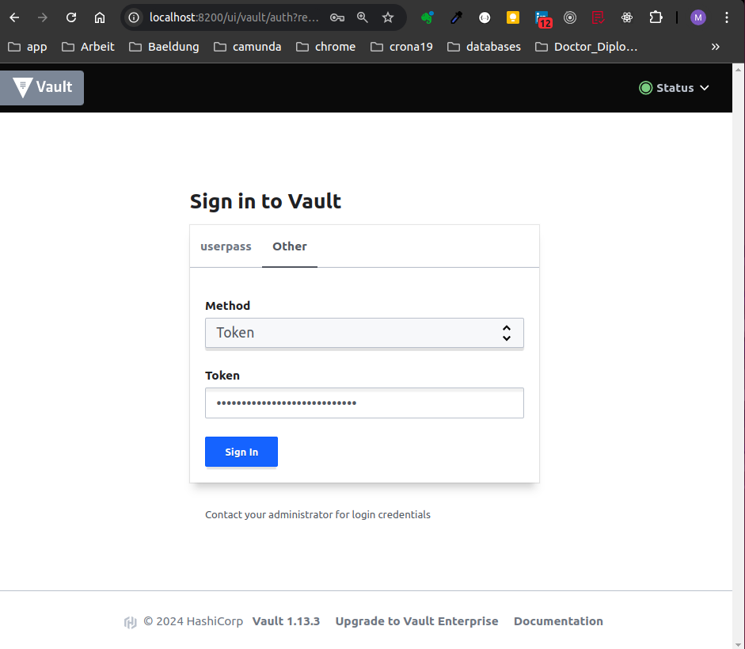
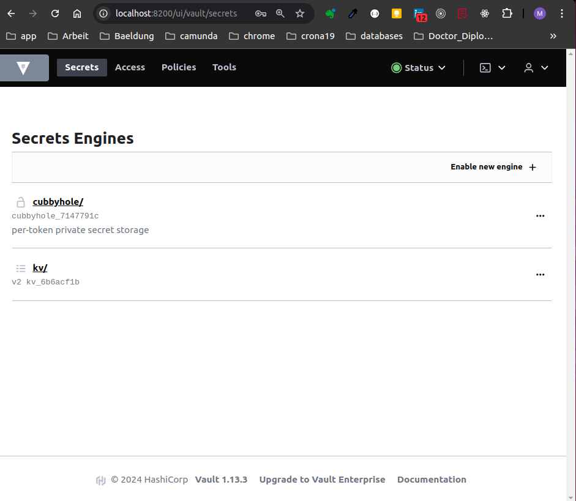

# vault
This is vault with consul Backend using to save enviroments Variables

## Consul
Build image for Consul 
```docker build -t dss/consul:0.1 --build-arg PWD=yourpassword . ```

## Vault
Build image for Vault with consul storage backend config 
```docker build -t dss/vault-consul:0.1 --build-arg PWD=yourpassword . ```

## Docker compose deploy vault
```docker-compose up -d vault-consul```#

## Connect to vault container
```docker exec -it vault_vault-consul_1 /bin/sh```<br>
```vault status ```

```
# vault status
Key                Value
---                -----
Seal Type          shamir
Initialized        false
Sealed             true
Total Shares       0
Threshold          0
Unseal Progress    0/0
Unseal Nonce       n/a
Version            1.13.3
Build Date         2023-06-06T18:12:37Z
Storage Type       consul
HA Enabled         true
```

## initialize vault cluster
```vault operator init```
```/ # vault operator init
Unseal Key 1: xxxxxxxxxxxxxxxxxxxxxxx
Unseal Key 2: xxxxxxxxxxxxxxxxxxxxxxx
Unseal Key 3: xxxxxxxxxxxxxxxxxxxxxxx
Unseal Key 4: xxxxxxxxxxxxxxxxxxxxxxx
Unseal Key 5: xxxxxxxxxxxxxxxxxxxxxxx

Initial Root Token: xxx.xxxxxxxxxxxxxxxxxxxxxxx
```
Please securely and store the keys above.
We use three of them wenn the vault re-sealed, restarted, or stopped
## Unsealed vault with three keys
```vault operator unseal``` or directly from 

http://localhost:8200/ui/vault



### Secrets
